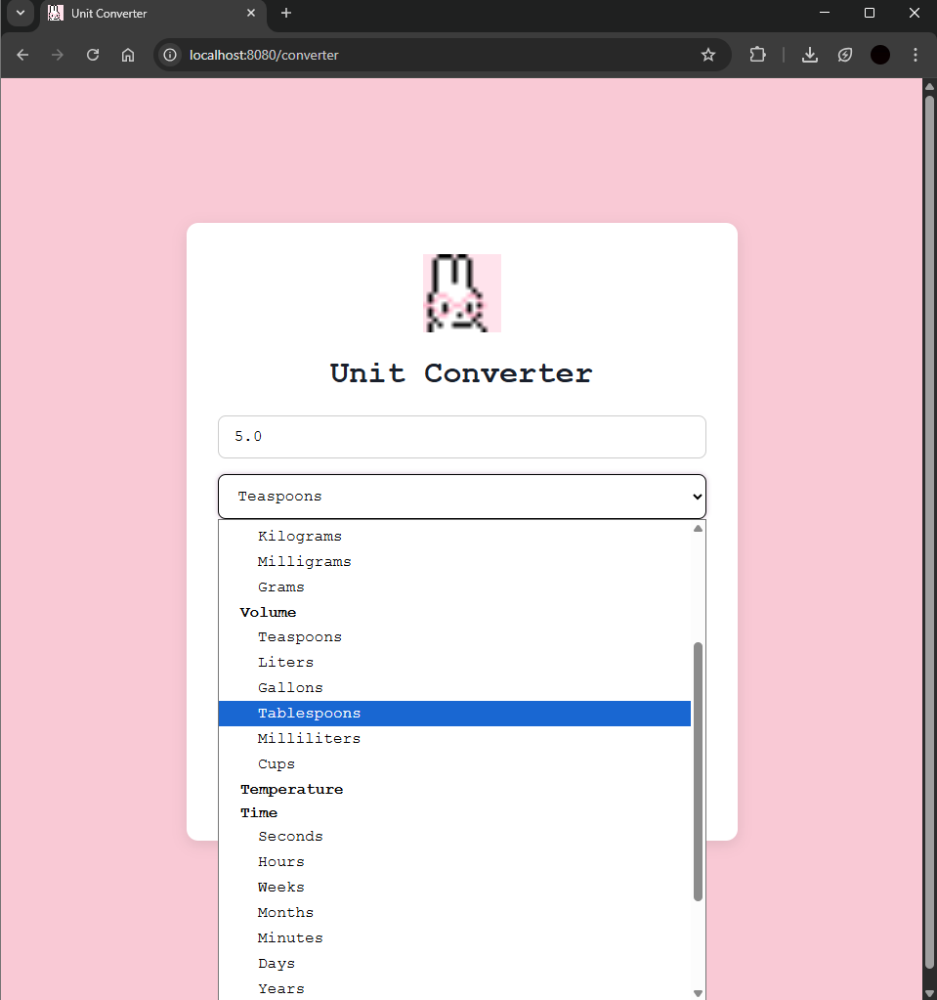
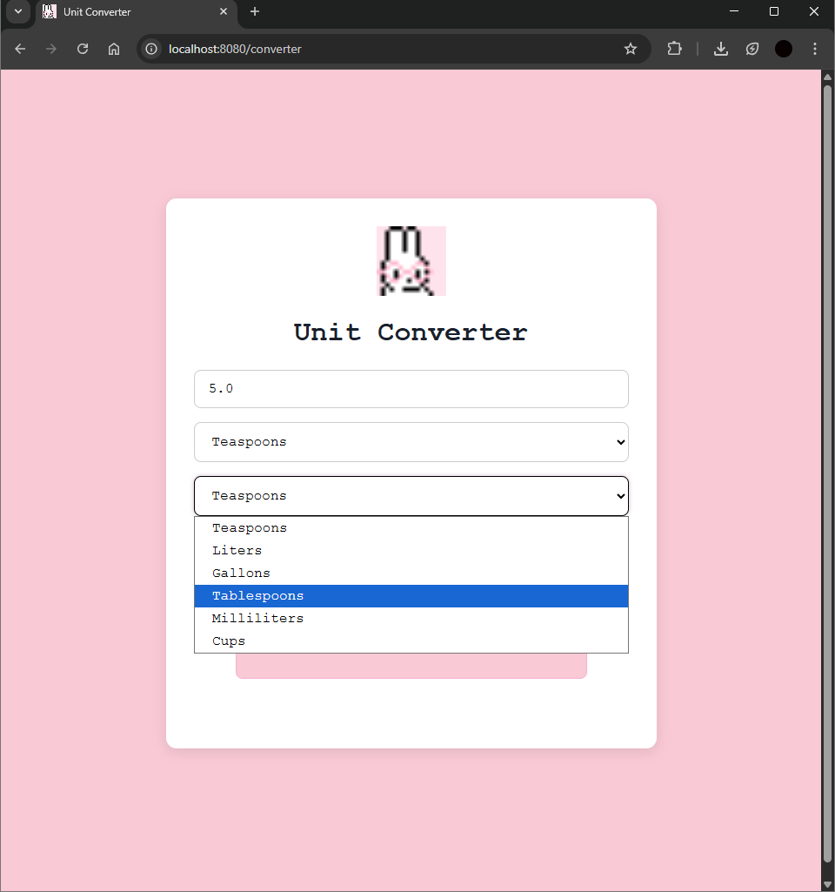

# Unit Converter Web Application

A simple **Spring Boot + Thymeleaf** web application that converts values between various units including length, mass, volume, temperature, time, and power. The app ensures user-friendly formatting for both inputs and outputs, removing unnecessary decimal zeros.

---

## Features

- Convert between multiple unit categories:
  - **Length**: Meters, Kilometers, Miles, Feet
  - **Mass**: Kilograms, Grams, Pounds, Ounces
  - **Volume**: Liters, Milliliters, Gallons, Teaspoons, Tablespoons, Cups
  - **Temperature**: Celsius, Fahrenheit, Kelvin
  - **Time**: Seconds, Minutes, Hours, Days, Weeks, Months, Years
  - **Power**: Watts, Kilowatts, Horsepower, Lumens, Amperes
- Automatically filters "To Units" based on the selected "From Unit" category.
- Displays values with up to **2 decimals**, and removes unnecessary `.0`.
- Input field prevents invalid non-numeric entries while allowing decimals.

---

## Screenshots

---

## Technologies Used

- **Java 17**  
- **Spring Boot 3.x**  
- **Thymeleaf** for templating  
- **Maven** for dependency management  
- **HTML/CSS/JavaScript** for frontend  

